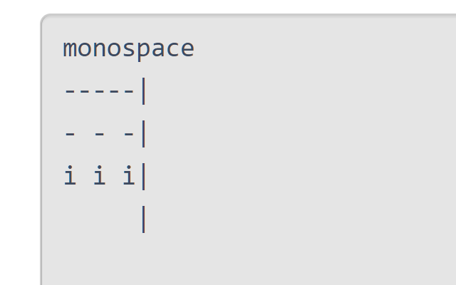
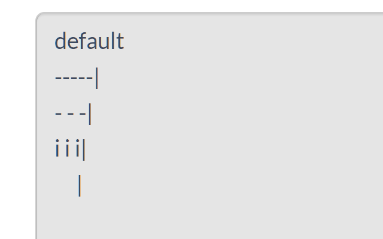

**This extension is deplecated.**
It has been written for the editor v1. Now one can use the newer version: [ReleaseNotes/2020/04/14/Editor v2 (同時編集エディタ) 正式リリースのお知らせ - docs.esa.io](https://docs.esa.io/posts/378).

# esa-monospace-editor

A chrome extension for applying monospace font-familly in esa.io editor.

## links

- [chrome web store](https://chrome.google.com/webstore/detail/esa-monospace-editor/lbemebpoppapapgapkdmafbalajhaeje?hl=ja)
- github: <https://github.com/KosukeMizuno/esa-monospace-editor>

# Screenshot

Comparing esa.io editor with / without this extension:

